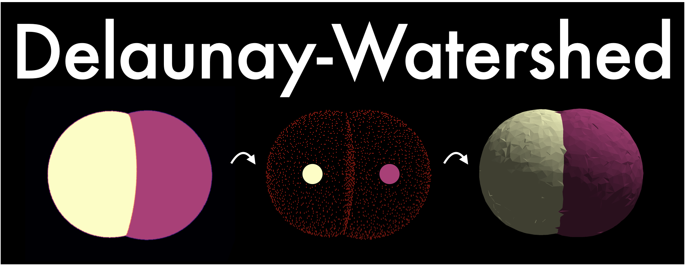
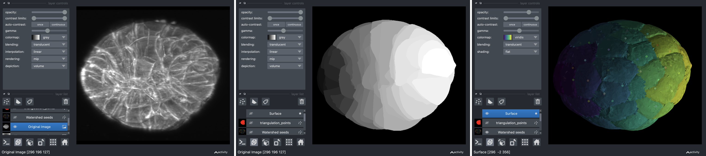
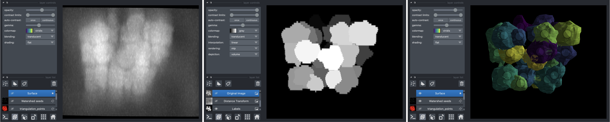

# Delaunay-Watershed 3D




**Delaunay-Watershed-3D** is an algorithm designed to reconstruct a sparse representation of the geometry of tissues and cell nuclei from instance segmentations, in 3D. It accomplishes this by building multimaterial meshes from segmentation masks. These multimaterial meshes are perfectly suited for **storage, geometrical analysis, sharing** and **visualisation of data**. We provide high level APIs to extract geometrical features from the meshes, as well as visualisation tools based on [polyscope](https://polyscope.run) and [napari](https://napari.org).

Delaunay-Watershed was created by Sacha Ichbiah during his PhD in [Turlier Lab](https://www.turlierlab.com), and is maintained by Sacha Ichbiah, Matthieu Perez and Hervé Turlier. For support, please open an issue.
A preprint of the method will be published soon. If you use our library in your work please cite the paper. 

Introductory notebooks with precise use case are provided.
The algorithm takes as input segmentation masks and return multimaterial triangle meshes (3D).

This method is used as a backend for [forceviewer3d](https://www.todo), our 3D tension inference library.


### Example 

Load an instance segmentation, reconstruct its multimaterial mesh, and extract its geometry:

```shell
pip install delaunay-watershed-3d

```

```py
from dw3d import geometry_reconstruction_3d

## Load the labels
import skimage.io as io
labels = io.imread("data/Images/1.tif")

## Reconstruct a multimaterial mesh from the labels
DW = geometry_reconstruction_2d(labels,(image, min_dist = 5, expansion_labels =0,print_info=True)
DW.plot_cells_polyscope()
v = DW.plot_in_napari(add_mesh=True)

## Use the mesh to analyze the geometry:
Mesh=DW.return_dcel()
Mesh.compute_curvatures_interfaces()
Mesh.compute_areas_interfaces()
Mesh.compute_volume_cells()
Mesh.compute_length_trijunctions()

```

### Installation

`pip install delaunay-watershed-3d`

---

### API and Documentation

#### 1 - Creating a multimaterial mesh:
The first step is to convert your instance segmentation into a multimaterial mesh

- `geometry_reconstruction_3d(labels,min_dist = 5, expansion_labels = 0,original_image = None,print_info = False, mode='torch')`: 
    - `Mesh` is a `DCEL_Data` object
    - `min_dist` defines the minimal distance, in pixels, between two points used for the delaunay-triangulation
    - `expansion_labels` can be used to expand the labels and make them touch each other.
    - `original_image` can be used for visualization purposes in napari
    - `print_info` measure time between several checkpoints and give usefull informations about the procedure
    - `mode` can be `torch` or `skimage`. It is highly recommeded to use torch
    - `return DW`, an object containing visualization and export utilities

#### 2 - Visualize and export the mesh

Once a `DW` object is generated, we can use its methods the visualize and export the result: 
- `DW:`
    - `self.plot_cells_polyscope()` plot the resulting mesh in polyscope
    - `self.plot_in_napari(add_mesh=True)` offers more information about the procedure.
    - `self.return_mesh()` `return` (`Verts`,`Faces_multimaterial`): 
        - `Verts` is an V x 3 numpy array of vertex positions
        - `Faces_multimaterial` is an F x 5 numpy array of Edges and material indices, where at each row the 3 first indices refers to a vertex and the 2 last refer to a given material, 0 being the exterior media
    - `self.return_dcel()` return a `DCEL_Data` object, i.e a Half-edge implementation of the mesh

#### 3 - Analyze the geometry

A `DCEL_Data` object can be used to analyze the geometry:

- `DCEL_Data:`
    - `self.compute_angles_tri()` returns a dictionnary with the values of every angles formed by the cells (in rad)
    - `self.compute_compute_curvatures(laplacian = "robust",weighted = True)` returns a dictionnary with the values of the mean curvature averaged on all the vertices of all the interfaces. `laplacian` can be either "cotan" or "robust". If `weighted`, the sum is scaled with vertices areas.
    - `self.compute_length_halfedges(), self.compute_areas_faces(), self.compute_centroids_cells(), self.compute_areas_cells(), self.compute_areas_interfaces(), self.compute_volume_cells(), compute_length_trijunctions()

---
### Biological use-cases

#### Geometrical reconstruction of P.Mammilata Embryo
Data from [Guignard et al.](https://www.science.org/doi/10.1126/science.aar5663)



#### Geometrical reconstruction of Cell Nuclei
Data from [Stardist](https://github.com/stardist/stardist)



---


### Credits, contact, citations
If you use this tool, please cite the associated preprint: 
Do not hesitate to contact Sacha Ichbiah and Hervé Turlier for practical questions and applications. 
We hope that **Delaunay-Watershed** could help biologists and physicists to shed light on the mechanical aspects of early development.

